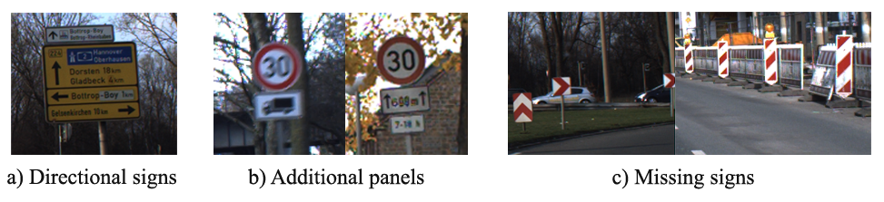
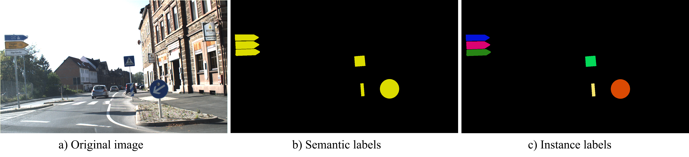

# German Traffic Sign Detection Benchmark - Extended Version

Following the trend for evaluating traffic sign detection methods, we proposed an extended version of the GTSDB, labeling traffic signs not included in the dataset but visible and recognizable in the scenes. This version contains the same number of images with complete information about the text and symbol traffic signs. The following image shows some examples of the traffic signs visible in the original GTSDB and not contemplated in their ground truth.

Differently from the original version, which provides RoIs labeled with 43 classes grouped into four categories for detection approaches, our proposed extended version also includes two more formats of ground truth to perform semantic and instance segmentation. This dataset comprises six extra categories with 164 classes following the definition from the [European Traffic Sign Dataset (ETSD)](https://ieeexplore.ieee.org/abstract/document/8558481).  

## Data labeling
[Meletis and Dubbelman](https://github.com/pmeletis/IV2018-hierarchical-semantic-segmentation-for-heterogeneous-datasets/tree/master/datasets) labeled the masks for the 43 classes originally considered in the GTSDB and provided them to us. We labeled, in the same way, the masks of the missing sings from the GTSDB dataset. In other words, we labeled all the image pixels that correspond to a traffic sign, and the rest are labeled as background (2 classes - traffic sign and background). We used the [LIBLABEL tool](http://www.cvlibs.net/software/liblabel/) in MATLAB, and annotated all the recognizable traffic signs with a polygon. In this way, we obtain a mask and instance for each sign to follow the same standard as Meletis and Dubbelman.

We used the Mapillary format as a standard definition for the segmentation images. The instance images are saved with 16 bits, where the first 8 correspond to the semantic class and the last 8 to the instance ID. The following image shows an example of a labeled image of the GTSDB database together with its corresponding semantic and instance outputs.

## Dataset details
The extended version of the GTSDB is labeled with 164 classes following the definition of the European Traffic Sign Database. It contains 2655 traffic signs:
- 1814 labels for the train set and 
- 841 for the test set. 

| Category      | Original Train  | Original Test | Extended Train  | Extended Test |
| ------------- | :-------------: | :-----------: | :-------------: | :-----------: |
| Danger        |   156           | 63            | 156             | 66            |
| Priority      |   -             | -             | 128             | 74            |
| Prohibitory   | 396             | 161           | 478             | 193           |
| Mandatory     | 114             | 49            | 122             | 56            |
| Special regulation | -          | -             | 115             | 73            |
| Information   | -               | -             | 0               | 1             |
| Direction     | -               | -             | 355             | 171           |
| Additional panels | -           | -             | 172             | 109           |
| Others        | 186             | 88            | 284             | 92            |
| Unknown       | -               | -             | 4               | 6             |
| **Total**     | **852**         | **361**       | **1814**        | **841**       |

